# Оглавление

1. [Лабораторная работа №1: Разработка пользовательского интерфейса (GUI) для языкового процессора](#лабораторная-работа-1-разработка-пользовательского-интерфейса-gui-для-языкового-процессора)

2. [Лабораторная работа №2: Разработка лексического анализатора (сканера)](#лабораторная-работа-2-разработка-лексического-анализатора-сканера)

3. [Лабораторная работа №3: Разработка синтаксического анализатора (парсера)](#лабораторная-работа-3-разработка-синтаксического-анализатора-парсера)

4. [Лабораторная работа №4: Регулярные выражения](#лабораторная-работа-4-регулярные-выражения)

5. [Лабораторная работа №5: Построение AST и семантические проверки](#лабораторная-работа-5-построение-ast-и-семантические-проверки)

6. [Лабораторная работа №7: Анализ и преобразование кода с использованием Clang и LLVM](#лабораторная-работа-7-анализ-и-преобразование-кода-с-использованием-clang-и-llvm)
# Курсовая работа для дисциплины теории формальных языков и компиляторов
## Лабораторная работа №1 : Разработка пользовательского интерфейса (GUI) для языкового процессора
**Цель работы:** Создание кроссплатформенного графического интерфейса (GUI) для языкового процессора в виде специализированного текстового редактора.

**Автор:** Дядов Владислав \
**Группа:** АВТ-314

**Описание проекта:** Данное приложение является пользовательским интерфейсом (GUI) для языкового процессора. Приложение созданно с помощью фреймворка Qt на языке программирования C++. 

Интерфейс программы включает все требуемые компоненты:
- Главное меню с разделами "Файл", "Правка", "Текст", "Пуск", "Справка"
- Панель инструментов с кнопками быстрого доступа
- Область ввода/редактирования текста (TextEdit)
- Область вывода результатов (TableWidget)

**Используемые технологии:**

| Компонент | Технология |
| --------- | ---------- |
| Язык программирования | C++ |
| Фреймворк для GUI | Qt |
| Среда разработки | Qt Designer |
| Версия Qt | Qt 6.10.2 |
| Операционная система | Windows 10/11 |

**Инструкция по сборке и запуску:**

1. Открыть проект `Compiler.pro` в Qt Creator
2. Выбрать конфигурацию сборки `Release`
3. Выполнить сборку проекта: **Сборка** → **Собрать проект Compiler**

**Готовый исполняемый файл:** build\Desktop_Qt_6_10_2_MinGW_64_bit-Release\release/Compiler.exe

**Описание интерфейса и функций (руководство пользователя):**

При запуске приложения можно будет увидеть поле для ввода, поле для вывода, панель быстрого доступа, а так же меню дня управления приложением.


<p align="center">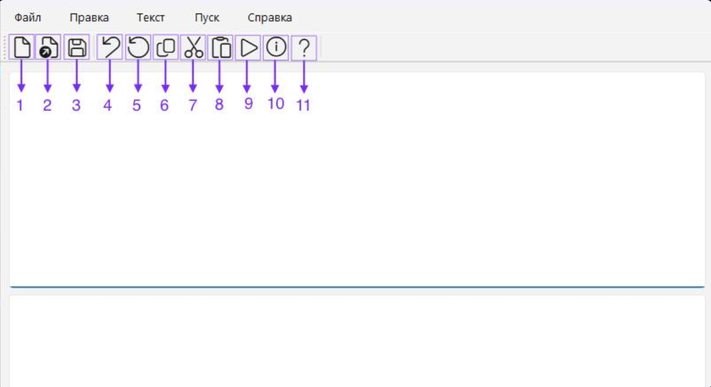</p>

1. Кнопка "создать" новый документ
2. Кнопка "открыть" существующий документ
3. Кнопка "сохранить" текущие изменения в документе
4. Кнопка "отменить" изменения
5. Кнопка "повтор" последнего изменения
6. Кнопка "скопировать" текстовый фрагмент
7. Кнопка "вырезать" определенный текстовый фрагмент
8. Кнопка "вставить" определенный текстовый фрагмент
9. Кнопка "запуск синтаксического анализатора"
10. Кнопка показать "справку" (руководства пользователя)
11. Кнопка показать "информацию о программе"

При нажатии на пункт меню "Файл" откроется дополнительное меню, где можно выполнить след.команды: создать, открыть, сохранить файл, произвести выход из проложения.

<p align="center">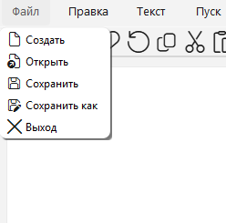</p>

При нажатии на пункт меню "Правка" откроется доп.меню, где можно производить разного рода действия с кодом.

<p align="center">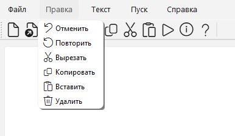</p>

При нажатии на пункт меню "Текст" откроется доп.меню, где можно посмотреть все для текста кода.

<p align="center">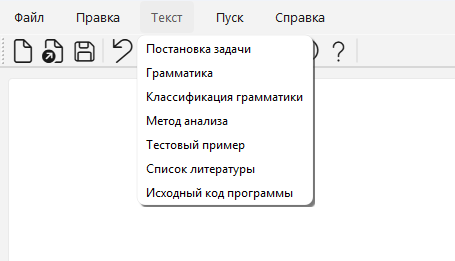</p>

При нажатии на пункт меню "Пуск", приложение выполнит код и выведет в панели вывода ошибки, если они там есть.

<p align="center">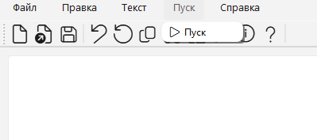</p>

При нажатии на пункт меню "Справка" откроется доп.меню, где можно увидеть и ознакомиться со сведениями о программе.

<p align="center">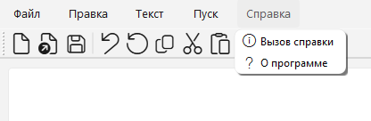</p>

**Ограничения:**
1. Функциональные ограничения:
- Интерфейс изначально спроектирован как каркас языкового процессора; в текущей версии проекта к меню **«Пуск»** подключены лексический и синтаксический анализ, вывод токенов, таблиц ошибок и AST (см. лабораторные работы №2–3). Полноценный компилятор (все конструкции языка, генерация кода) не реализован.
- Поддерживается только синтаксическая конструкция из варианта задания (объявление строковой константы).
2. Технические ограничения:
- Для запуска необходим установленный Framework Qt 6.10.2

## Лабораторная работа №2: Разработка лексического анализатора (сканера)
**Цель работы:** Проектирование алгоритма (диаграммы состояний) и программная реализация сканера для выделения лексем согласно правилам языка Rust-Pascal style.

**Вариант задания:** Объявление и инициализация строковой константы.

**Пример строки:** `Const Stroka: string = 'Привет';`

### Таблица лексем (Классификация)

| Код (ID) | Тип лексемы | Примеры | Описание |
| --- | --- | --- | --- |
| 14 | Ключевое слово | `Const`, `string` | Зарезервированные слова языка |
| 2 | Идентификатор | `Stroka`, `myVar` | Имена констант (буквы, далее буквы/цифры) |
| 12 | Разделитель | `:`, `;` | Символы пунктуации |
| 10 | Оператор присваивания | `=` | Оператор инициализации значения |
| 3 | Строковая константа | `'Привет'` | Текст, заключенный в одинарные кавычки |
| 11 | Пробел | (пробельные символы) | Пробельные символы (WHITESPACE) |

### Диаграмма состояний (Finite Automaton)

Лексический анализатор построен на базе детерминированного конечного автомата.

<p align="center">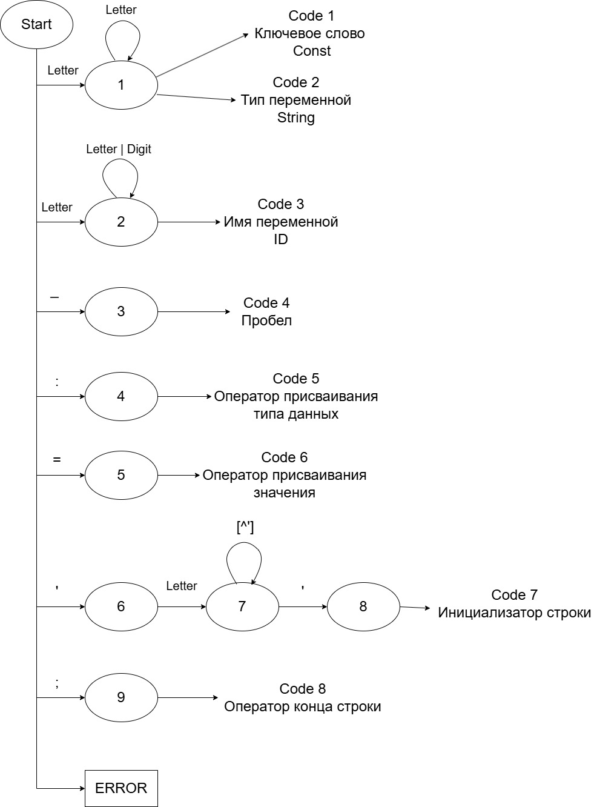</p>

### Краткое описание работы автомата:
- Состояние 1: старт (ожидается ключевое слово `Const`).
- Состояния 2–4: распознавание имени константы (идентификатор). Вход в идентификатор — по `Letter`, дальше допускается цикл `Letter|Digit`.
- Состояния 5–7: распознавание структурной части объявления: `:` → `string` → `=`.
- Состояние 8: разбор строкового литерала. Вход по `'`, затем цикл по любым символам, **кроме** `'`; выход по закрывающей кавычке.
- Состояния 10–11: завершение оператора по `;` (конечное состояние).
- ERROR: при недопустимом символе или нарушении ожидаемого порядка лексем автомат переходит в состояние ошибки.

### Тестовые примеры

1. **Корректная строка**

```pascal
Const Stroka: string = 'Привет';
```

<p align="center">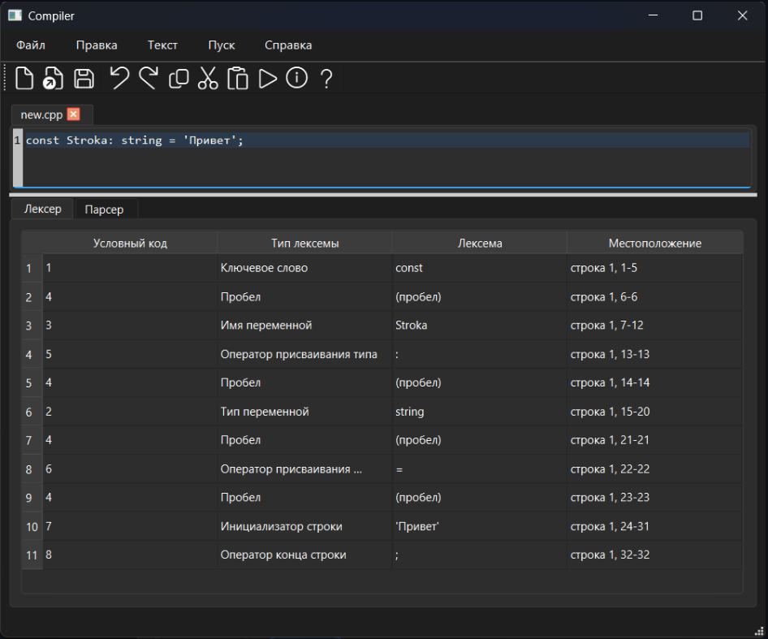</p>

- **Ввод:** одна полная строка с объявлением строковой константы.
- **Ожидаемый результат:** успешный разбор всех лексем таблица содержит:
  - `Const` (код 14, ключевое слово)
  - `Stroka` (код 2, идентификатор)
  - `:` (код 5, разделитель)
  - `string` (код 14, ключевое слово)
  - `=` (код 10, оператор присваивания)
  - `'Привет'` (код 7, строковая константа)
  - `;` (код 8, конец оператора)

2. **Незакрытая строка**

```pascal
Const Stroka: string = 'Привет;
```

<p align="center">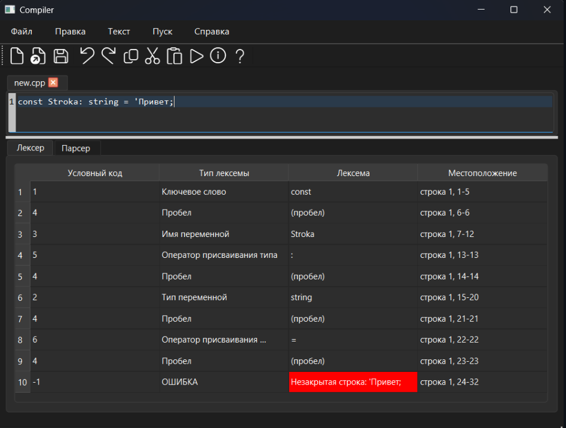</p>

- **Ввод:** строка со строковой константой без закрывающей кавычки.
- **Ожидаемый результат:** ошибка на последней позиции (код -1).
  - Сообщение ошибки: "Незакрытая строка: 'Привет;"
  - Демонстрирует корректное обнаружение ошибки при переходе в состояние ERROR автомата.

3. **Многострочный пример**

```pascal
Const Stroka: string = 'Привет';
Const Stroka2: string = 'Мир';
```

<p align="center">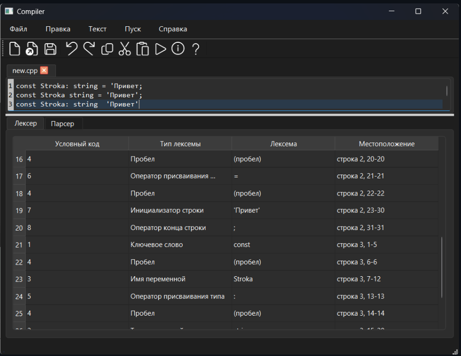</p>

- **Ввод:** две строки с объявлениями строковых констант.
- **Ожидаемый результат:** последовательный разбор нескольких строк с корректной фильтрацией лексем по строкам.
  - Таблица показывает лексемы со ссылками на строки исходного кода (строка 2, строка 3).
  - Каждая строка разбирается независимо с корректными токенами и их позициями.

## Лабораторная работа №3: Разработка синтаксического анализатора (парсера)

**Название:** Разработка синтаксического анализатора (парсера).

**Цель работы:** Изучить назначение и принципы работы синтаксического анализатора в структуре компилятора. Спроектировать грамматику для конструкции из варианта задания, описать схему метода разбора, выполнить программную реализацию парсера с нейтрализацией синтаксических ошибок в духе **метода Айронса** (продолжение разбора после ошибки). Интегрировать модуль в приложение языкового процессора (лабораторная работа №1) совместно с лексическим анализатором (лабораторная работа №2).

### Постановка задачи

Разработать синтаксический анализатор для конструкции **объявления и инициализации строковой константы** в стиле Rust-Pascal (как в лабораторной работе №2), обеспечить наглядный вывод результатов: при успешном разборе строки — сообщение об отсутствии синтаксических ошибок; при ошибках — таблица с описанием каждой ошибки (фрагмент, позиция, текст диагностики). Дополнительно построенное абстрактное синтаксическое дерево используется последующими этапами (семантический анализ, вывод дерева в интерфейсе).

### Требования к разработке парсера

- Разработать грамматику для заданной синтаксической конструкции (однострочное объявление константы).
- Построить схему метода анализа на основе грамматики (линейная цепочка ожидаемых классов лексем на строке исходного текста).
- Выполнить программную реализацию алгоритма синтаксического разбора на C++ (модуль `parser.cpp` / `parser.h`).
- Реализовать восстановление после синтаксических ошибок по идее метода Айронса: фиксация ошибки, попытка **ресинхронизации** на ожидаемых символах и доведение разбора строки до конца.
- **Входные данные:** строка (или несколько строк) программного кода из области редактирования; на вход парсера подаётся поток токенов от лексера (пробельные токены с кодом `4` отбрасываются при инициализации парсера).
- **Выходные данные:** список структур `SyntaxError` (фрагмент, строка, колонка, описание); при отсутствии ошибок в таблице выводится сообщение «Синтаксических ошибок нет!»; при корректной строке дополнительно накапливается узел объявления в `ProgramNode` (`ast.h`).

### Вариант задания

**Конструкция:** объявление строковой константы с инициализацией.

**Примеры корректных входных строк:**

```pascal
Const Stroka: string = 'Привет';
Const myConst: string = 'Мир';
Const x: string = '';
```

Регистр ключевого слова `const` и типа `string` в лексере не различается (`Const` и `const` эквивалентны).

### Разработка грамматики

Нетерминальные символы выбираются так, чтобы отразить порядок лексем на одной строке исходного текста.

<p align="center">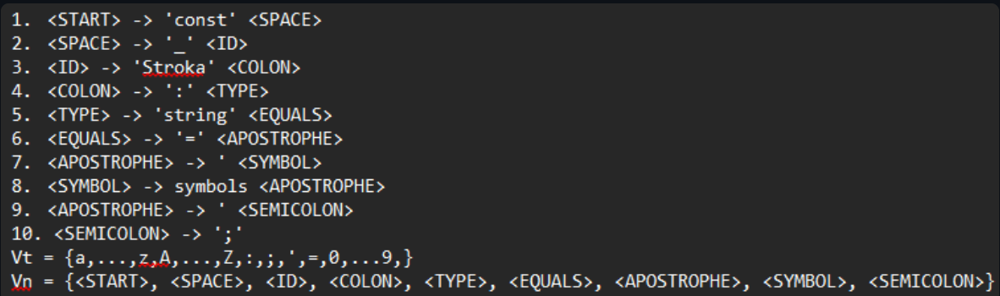</p> 

**Классификация грамматики.** Язык одной корректной строки задаётся **линейной** цепочкой терминалов фиксированной длины; такую грамматику можно считать **автоматной** (регулярной): все продукции, записанные через введение промежуточных нетерминалов для позиций в шаблоне, приводятся к виду `A → a B`, где `a` — один терминал (класс лексемы), а `B` — нетерминал «хвоста» цепочки либо пустая цепочка на конце.

**Соответствие лексемам реализации** (коды токенов в программе, файл `lexer.cpp`):

| Шаг | Ожидаемый код | Лексема (смысл) |
| --- | --- | --- |
| 1 | `1` | ключевое слово `const` |
| 2 | `3` | имя константы (идентификатор) |
| 3 | `5` | `:` |
| 4 | `2` | ключевое слово `string` |
| 5 | `6` | `=` |
| 6 | `7` | строковый литерал `'...'` |
| 7 | `8` | `;` |

### Схема грамматики (рисунок)

<p align="center">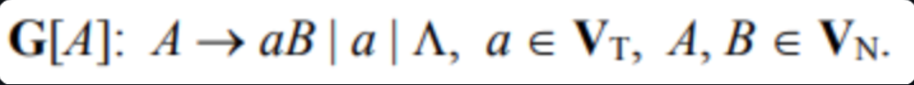</p>

### Метод анализа

В программе используется **детерминированный разбор по шаблону** (последовательная проверка цепочки кодов токенов на одной строке):

- Функция `tryParseConstLine()` проверяет, что на текущей строке подряд идут ровно восемь токенов с кодами `1, 3, 5, 2, 6, 7, 8`, без лишних токенов на этой же строке. При успехе строится фрагмент AST (`ConstDeclNode` с типом `string` и литералом).
- Если шаблон не совпал, для этой строки вызывается `parseLineWithErrors()` — пошаговый проход с диагностикой.

### Схема метода анализа (рисунок)

<p align="center">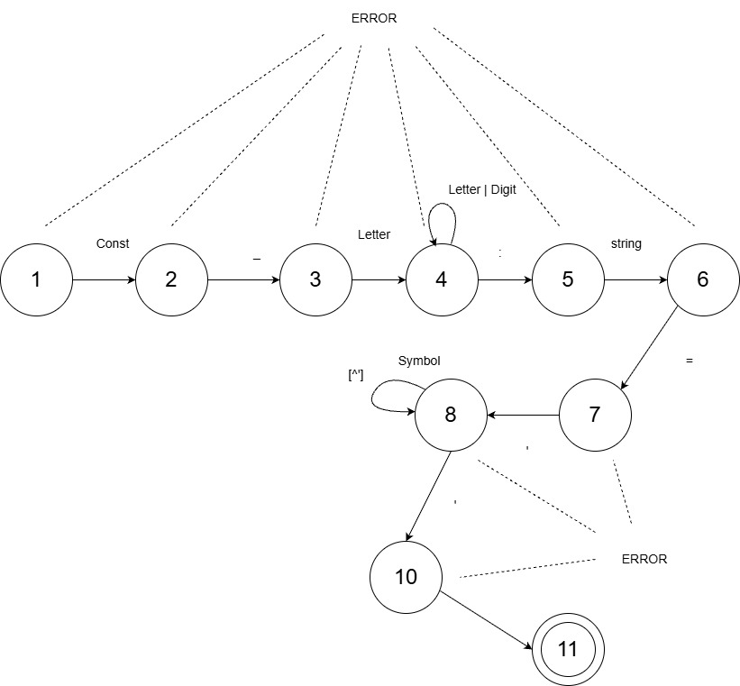</p>

### Диагностика и нейтрализация синтаксических ошибок (метод Айронса)

**Метод Айронса** в классической формулировке — это стратегия **восстановления при ошибках**: не останавливать весь разбор на первой ошибке, а зафиксировать её и продолжить анализ, сдвигаясь по входу до «безопасной» точки.

В данной реализации идея реализована так:

1. **Пошаговые ожидания.** Для каждой позиции в шаблоне задаётся ожидаемый код токена и человекочитаемое сообщение (например, «Ожидалось ':'», «Ожидалось 'string'» и т.д.). Ошибка на шаге регистрируется не более одного раза.
2. **Продвижение при несовпадении.** Если токен не подходит и нет «пропуска» лишнего шага, позиция во входном потоке увеличивается, чтобы не зациклиться; при частичном совпадении с «забеганием вперёд» фиксируется пропущенный шаг.
3. **Структурная ресинхронизация** (`tryStructuralSyncOnLine` в `parser.cpp`): между текущей позицией и концом строки ищется ожидаемый токен среди фрагментов, классифицируемых как «мусор» (лишние идентификаторы и одиночные недопустимые символы), с отдельной обработкой случаев пропуска `:` перед `=` и имени перед `=`. Это аналог **пропуска входа до встречи с ожидаемым символом**, после чего разбор продолжается с найденной позиции.
4. **Лексические ошибки и «хвост» строки.** Незакрытая строка распознаётся по префиксу лексемы из `token.h`; остаток строки после прохода всех шагов шаблона в `parseLineWithErrors` обрабатывается как лишние или ошибочные лексемы с отдельными сообщениями («Лишняя лексема», «Лексическая ошибка» и др.).

В результате пользователь получает **таблицу всех обнаруженных на строке проблем**, а разбор документа переходит к следующей строке.

### Интеграция в графический интерфейс

При выборе **«Пуск»** в `mainwindow.cpp` выполняется цепочка: лексический разбор текста редактора → заполнение таблицы токенов → создание `Parser`, вызов `parse()` → вывод синтаксических ошибок во вкладку ошибок → семантический анализ и обновление представления AST. Таким образом, парсер встроен в уже разработанный интерфейс языкового процессора.

### Тестовые примеры

1. **Корректная строка**

```pascal
Const Stroka: string = 'Привет';
```

- **Ожидаемый результат:** синтаксических ошибок нет; в AST добавляется объявление константы `Stroka` со значением строки без внешних кавычек.

<p align="center">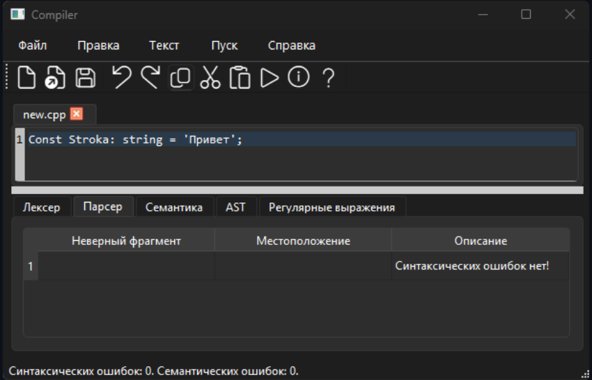</p>

2. **Незакрытая строка (лексическая ошибка, обрабатываемая и парсером)**

```pascal
Const Stroka: string = 'Привет;
```

- **Ожидаемый результат:** лексер выдаёт токен ошибки; парсер фиксирует проблему на шаге строкового литерала и продолжает диагностику по строке.

<p align="center">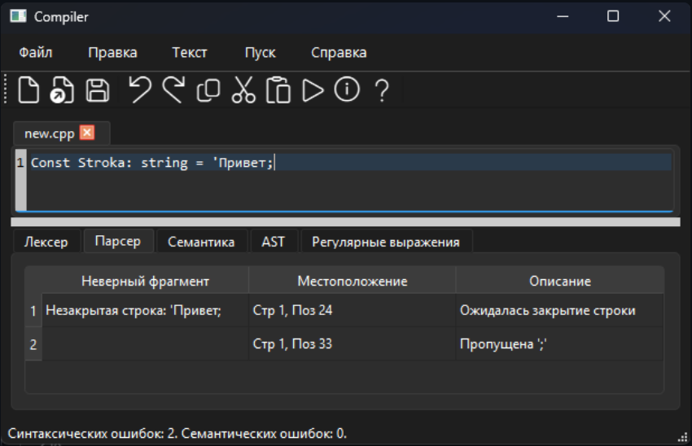</p>

## Лабораторная работа №4: Регулярные выражения

**Цель работы:** освоить применение регулярных выражений для поиска и валидации строковых данных, а также интеграцию поиска по шаблону в пользовательский интерфейс.

### Постановка задачи

**Вариант задания:** решить 3 задачи с использованием регулярных выражений.

1. Построить регулярное выражение, описывающее **КПП организации** (9 цифр).
2. Построить регулярное выражение, описывающее **имя пользователя** (набор букв и цифр длиной 2–30 символов, первый символ — буква).
3. Построить регулярное выражение для проверки данных на соответствие формату кодирования **Base32**.


### Решение задач (регулярные выражения)

#### Задача 1. КПП (ровно 9 цифр)

- **Описание задачи:** проверить строку на соответствие формату КПП (только цифры, длина 9).
- **Регулярное выражение:**
  - `^\d{9}$`
- **Пояснение обозначений:**
  - `^` — начало строки;
  - `\d` — одна цифра (0–9);
  - `{9}` — повторить ровно 9 раз;
  - `$` — конец строки.
- **Примеры строк, которые должны находиться:**
  - `123456789`
- **Примеры строк, которые не должны находиться:**
  - `123` (мало цифр)
  - `1234567890` (слишком много)
  - `12345678a` (посторонний символ)
- **Тестовые примеры (скриншоты):**

<p align="center">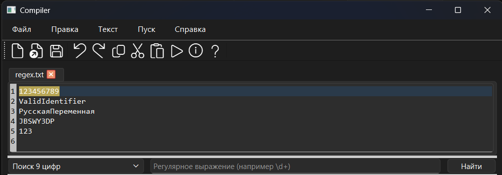</p>

#### Задача 2. Имя пользователя (2–30 символов, 1-й символ — буква)

- **Описание задачи:** валидировать имя пользователя: первый символ — буква; далее — буквы/цифры; длина 2–30.
- **Регулярное выражение:**
  - `^[a-zA-Zа-яёА-ЯЁ][a-zA-Zа-яёА-ЯЁ0-9]{1,29}$`
- **Пояснение обозначений:**
  - `^` — начало строки;
  - `[a-zA-Zа-яёА-ЯЁ]` — одна буква (латиница или кириллица);
  - `[a-zA-Zа-яёА-ЯЁ0-9]{1,29}` — ещё от 1 до 29 символов: буквы (лат/кир) или цифры;
  - суммарная длина: \(1 + [1..29] = 2..30\);
  - `$` — конец строки.
- **Примеры строк, которые должны находиться:**
  - `ValidIdentifier`
  - `РусскаяПеременная`
  - `JBSWY3DP`
- **Примеры строк, которые не должны находиться:**
  - `123456789` (первый символ — цифра)
  - `a` (слишком короткая)
- **Тестовые примеры (скриншоты):**

<p align="center">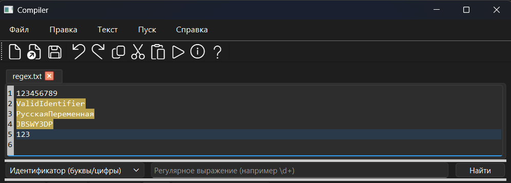</p>

#### Задача 3. Формат Base32 (RFC-подобный алфавит A–Z и 2–7)

- **Описание задачи:** проверить строку на соответствие формату Base32 (допустимый алфавит и корректное заполнение `=` в конце).
- **Регулярное выражение:**
  - `^([A-Z2-7]{8})*([A-Z2-7]{2}={6}|[A-Z2-7]{4}={4}|[A-Z2-7]{5}={3}|[A-Z2-7]{7}=)?$`
- **Пояснение обозначений (смысл шаблона):**
  - `^ ... $` — проверка всей строки целиком;
  - `([A-Z2-7]{8})*` — любое число полных блоков по 8 символов Base32;
  - `(...) ?` — необязательный «хвост» последнего блока с padding:
    - `{2}={6}` — 2 символа и 6 знаков `=`
    - `{4}={4}` — 4 символа и 4 знака `=`
    - `{5}={3}` — 5 символов и 3 знака `=`
    - `{7}=` — 7 символов и 1 знак `=`
  - внутри классов `[A-Z2-7]` допускаются только буквы `A..Z` и цифры `2..7`.
- **Примеры строк, которые должны находиться:**
  - `JBSWY3DP` (8 символов допустимого алфавита)
- **Примеры строк, которые не должны находиться:**
  - `123` (есть `1`, `3` — недопустимые для Base32 цифры)
  - `РусскаяПеременная` (недопустимый алфавит)
- **Тестовые примеры (скриншоты):**

<p align="center">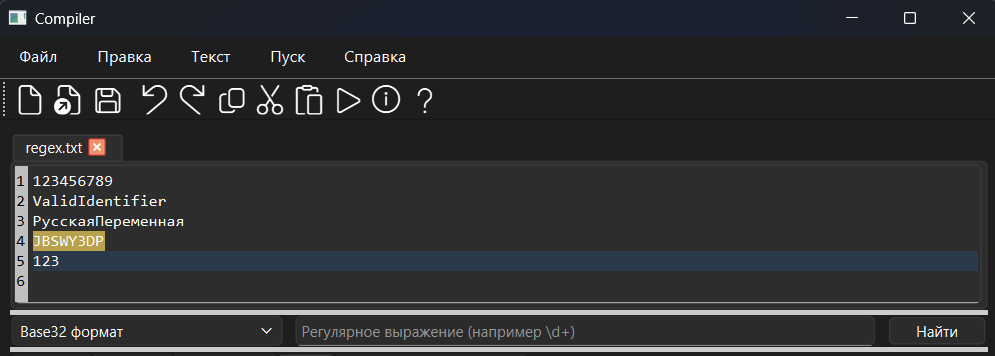</p>


### Дополнительное задание
#### Необходимо построить автомат по регулярному выражению. 
Для реализации автомата была выбрана 2 задача: bмя пользователя (2–30 символов, 1-й символ — буква)

<p align="center">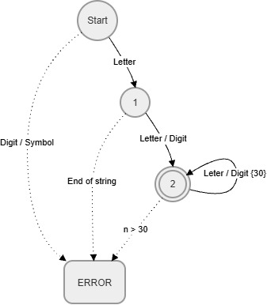</p>

---

## Лабораторная работа №5: Построение AST и семантические проверки

**Цель работы:** реализовать построение абстрактного синтаксического дерева (AST) для разобранных конструкций и выполнить семантический анализ: проверки контекстно-зависимых условий с формированием понятных сообщений об ошибках.

### Вариант задания

**Тема:** построение AST и семантический анализ для конструкции объявления строковой константы.

**Примеры корректных строк:**

```pascal
Const Stroka: string = 'Привет';
Const myConst: string = 'Мир';
Const x: string = '';
```

### Контекстно-зависимые условия (реализованные проверки)

1. **Уникальность имён в области видимости (файл).**
   - **Суть:** повторное объявление одного и того же идентификатора запрещено.
   - **Пример:**
     - Ввод:
       ```pascal
       const str: string = 'hello';
       const str: string = 'hello';
       ```
     - **Ожидаемое сообщение:** `Повторное объявление идентификатора в области видимости`

2. **Ограничение длины строкового литерала.**
   - **Суть:** длина содержимого литерала (без кавычек) не должна превышать `255` символов (`MAX_STRING_LITERAL_LENGTH`).
   - **Ожидаемое сообщение:** `Длина строкового литерала превышает допустимое значение (255 символов)`
   - **Особенность вывода фрагмента:** если литерал длиннее 48 символов, в таблицу ошибок выводится префикс и `...`.

3. **Совместимость типов (поднабор языка).**
   - В текущей версии дерева декларации, у которых отсутствует `typeNode` или `literal`, **не попадают** в итоговый AST (узел отбрасывается). Диагностическое сообщение для этого случая не формируется, так как такие ошибки отлавливаются синтаксическим анализатором на предыдущем этапе.

### Рисунок AST для корректной строки

<p align="center">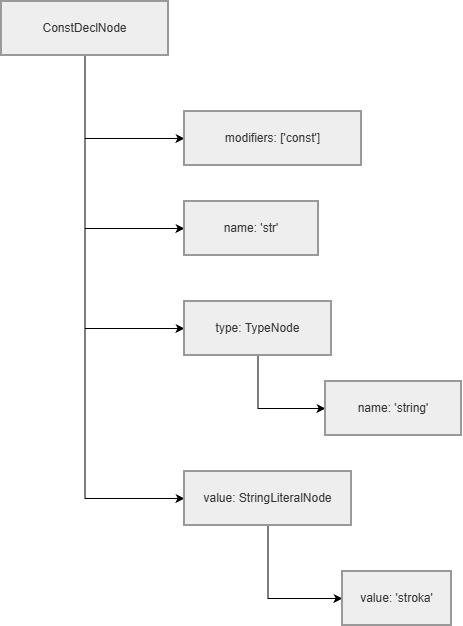</p>

___

**Тестовые примеры (скриншоты семантического анализатора):**

<p align="center">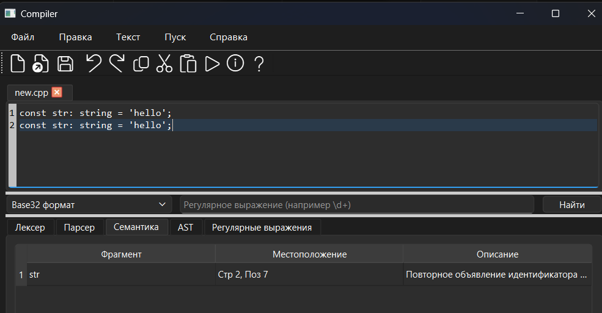</p>

### Структура AST

- **`ProgramNode`** — корневой узел программы; содержит список деклараций.
- **`ConstDeclNode`** — объявление константы: имя + (тип `string`) + строковый литерал.
- **`StringTypeNode`** — узел типа `string` (позиция в исходном тексте).
- **`StringLiteralNode`** — узел строкового литерала (значение хранится без внешних кавычек).
- **`SourcePos`** — позиция в исходнике (строка, столбец).

### Рисунок CST / AST

В качестве иллюстрации AST ниже приведён скрин вывода дерева для корректной строки:

<p align="center">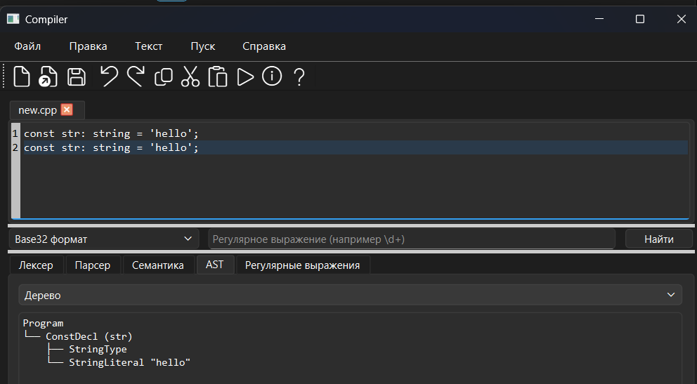</p>

### Формат вывода AST в программе

- **Дерево (`formatTree`)** — текстовый вывод с псевдографикой:
  - `Program`
  - `ConstDecl (<name>)`
  - дочерние узлы: `StringType`, `StringLiteral "<value>"`
- **JSON (`toJson`)** — сериализация дерева в JSON:
  - корень: `{"kind":"Program","declarations":[...]}`
  - декларация: `{"kind":"ConstDecl","name":...,"namePos":...,"children":[...]}`


## Лабораторная работа 7. Анализ и преобразование кода с использованием Clang и LLVM

**Постановка задачи**
Познакомиться с инструментами Clang и LLVM, научиться собирать AST и IR-промежуточное представление кода на C/C++, а также извлекать базовую информацию о программе (например, список функций).

**Общее задание**

Задания:
1. Получите IR для -O0.
2. Примените -O2 и найдите, исчезла ли переменная LIMIT.
3. Примените отдельно -constprop и -ipsccp.
4. Постройте CFG до и после оптимизаций.
5. Сделайте вывод о том, как и когда константа подставляется?

Работа с AST


Генерация LLVM IR


Оптимизация IR


Построение CFG


**Вариант индивидуального задания**
Строковые константы
```c
#include <stdio.h>

int main() {
    const char* msg = "Hello, World!";
    printf("%s\n", msg);
    return 0;
}
```

Работа с AST


Генерация LLVM IR с оптимизацией О0


Генерация LLVM IR с оптимизацией О2 и -mergeconst


**Сравнение**
| Характеристика | Первый файл (оптимизированный) | Второй файл (неоптимизированный) |
| :--- | :--- | :--- |
| **Вывод строки** | `puts("Hello, World!")` | `printf("%s\n", "Hello, World!")` |
| **Локальные переменные** | Отсутствуют | `alloca i32`, `alloca i8*` (для `int main()` и `char *str`) |
| **Оптимизация** | `optnone` отсутствует, агрессивная оптимизация | Присутствует атрибут `noinline nounwind optnone` |
| **Атрибуты функций** | `nofree nounwind uwtable` | `noinline nounwind optnone uwtable` |
| **Фрейм указатель** | `"frame-pointer"="none"` | `"frame-pointer"="all"` |

Построение CFG


**Вывод**

Производительность: Первый файл (оптимизированный) будет работать значительно быстрее. Он использует более эффективную библиотечную функцию (puts), не тратит время на работу со стеком для локальных переменных и не создает лишних инструкций по загрузке/сохранению данных.

Отладка: Второй файл (неоптимизированный) предназначен для разработки и отладки. Его код прямолинейно соответствует исходному коду на C, все переменные лежат в памяти и доступны отладчику (gdb, lldb).

Размер: Оптимизированный код, скорее всего, будет немного компактнее за счет отсутствия пролога/эпилога функции для работы с alloca и замены printf на puts.


**Доп задание**
Блок-схема
![Uploadi<svg xmlns="http://www.w3.org/2000/svg" xmlns:xlink="http://www.w3.org/1999/xlink" width="1911pt" height="1503pt" viewBox="0.00 0.00 1911.00 1503.00">
<g id="graph0" class="graph" transform="scale(1 1) rotate(0) translate(4 1499.4)">
<title>IR_Optimization</title>
<polygon fill="white" stroke="none" points="-4,4 -4,-1499.4 1906.97,-1499.4 1906.97,4 -4,4"/>
<g id="clust1" class="cluster">
<title>cluster_opt1</title>
<polygon fill="none" stroke="#e67e22" stroke-dasharray="5,2" points="10.04,-439 10.04,-1013.6 604.04,-1013.6 604.04,-439 10.04,-439"/>
<text xml:space="preserve" text-anchor="middle" x="307.04" y="-998.8" font-family="Consolas" font-size="12.00" fill="#e67e22">Оптимизация 1: Свёртка копий  (copyPropagation)</text>
</g>
<g id="clust2" class="cluster">
<title>cluster_opt2</title>
<polygon fill="none" stroke="#8e44ad" stroke-dasharray="5,2" points="612.04,-11.8 612.04,-513.4 1347.04,-513.4 1347.04,-11.8 612.04,-11.8"/>
<text xml:space="preserve" text-anchor="middle" x="979.54" y="-498.6" font-family="Consolas" font-size="12.00" fill="#8e44ad">Оптимизация 2: Дедупликация строковых констант  (deduplicateLiterals)</text>
</g>
<!-- SRC -->
<g id="node1" class="node">
<title>SRC</title>
<polygon fill="#d6eaf8" stroke="#555555" points="1205.19,-1495.4 904.89,-1495.4 904.89,-1421.4 1211.19,-1421.4 1211.19,-1489.4 1205.19,-1495.4"/>
<polyline fill="none" stroke="#555555" points="1205.19,-1495.4 1205.19,-1489.4"/>
<polyline fill="none" stroke="#555555" points="1211.19,-1489.4 1205.19,-1489.4"/>
<text xml:space="preserve" text-anchor="middle" x="1058.04" y="-1481.5" font-family="Consolas" font-size="11.00">Исходный код</text>
<text xml:space="preserve" text-anchor="middle" x="1058.04" y="-1468.3" font-family="Consolas" font-size="11.00">────────────────</text>
<text xml:space="preserve" text-anchor="middle" x="1058.04" y="-1455.1" font-family="Consolas" font-size="11.00">const a: string = 'Hi';</text>
<text xml:space="preserve" text-anchor="middle" x="1058.04" y="-1441.9" font-family="Consolas" font-size="11.00">const b: string = 'Hi';</text>
<text xml:space="preserve" text-anchor="middle" x="1058.04" y="-1428.7" font-family="Consolas" font-size="11.00">const c: string = 'Ok';</text>
</g>
<!-- AST -->
<g id="node2" class="node">
<title>AST</title>
<polygon fill="#d6eaf8" stroke="#555555" points="1211.19,-1373.4 904.89,-1373.4 904.89,-1369.4 900.89,-1369.4 900.89,-1365.4 904.89,-1365.4 904.89,-1294.2 900.89,-1294.2 900.89,-1290.2 904.89,-1290.2 904.89,-1286.2 1211.19,-1286.2 1211.19,-1373.4"/>
<polyline fill="none" stroke="#555555" points="904.89,-1369.4 908.89,-1369.4 908.89,-1365.4 904.89,-1365.4"/>
<polyline fill="none" stroke="#555555" points="904.89,-1294.2 908.89,-1294.2 908.89,-1290.2 904.89,-1290.2"/>
<text xml:space="preserve" text-anchor="middle" x="1058.04" y="-1359.5" font-family="Consolas" font-size="11.00">AST (ЛР 5)</text>
<text xml:space="preserve" text-anchor="middle" x="1058.04" y="-1346.3" font-family="Consolas" font-size="11.00">────────────────</text>
<text xml:space="preserve" text-anchor="middle" x="1058.04" y="-1333.1" font-family="Consolas" font-size="11.00">ProgramNode</text>
<text xml:space="preserve" text-anchor="middle" x="1058.04" y="-1319.9" font-family="Consolas" font-size="11.00">├── ConstDeclNode: a → 'Hi'</text>
<text xml:space="preserve" text-anchor="middle" x="1058.04" y="-1306.7" font-family="Consolas" font-size="11.00">├── ConstDeclNode: b → 'Hi'</text>
<text xml:space="preserve" text-anchor="middle" x="1058.04" y="-1293.5" font-family="Consolas" font-size="11.00">└── ConstDeclNode: c → 'Ok'</text>
</g>
<!-- SRC&#45;&gt;AST -->
<g id="edge1" class="edge">
<title>SRC-&gt;AST</title>
<path fill="none" stroke="black" d="M1058.04,-1421.12C1058.04,-1409.94 1058.04,-1397.37 1058.04,-1385.24"/>
<polygon fill="black" stroke="black" points="1061.54,-1385.32 1058.04,-1375.32 1054.54,-1385.32 1061.54,-1385.32"/>
<text xml:space="preserve" text-anchor="middle" x="1211.98" y="-1394.4" font-family="Consolas" font-size="10.00">ЛР 5: лексер + парсер + семантика</text>
</g>
<!-- GEN -->
<g id="node3" class="node">
<title>GEN</title>
<polygon fill="#d5f5e3" stroke="#555555" points="1093.35,-1232.2 1010.73,-1232.2 1010.73,-1208.2 1093.35,-1208.2 1105.35,-1220.2 1093.35,-1232.2"/>
<text xml:space="preserve" text-anchor="middle" x="1058.04" y="-1223.5" font-family="Consolas" font-size="11.00">generateTAC()</text>
<text xml:space="preserve" text-anchor="middle" x="1058.04" y="-1210.3" font-family="Consolas" font-size="11.00">ir.cpp</text>
</g>
<!-- AST&#45;&gt;GEN -->
<g id="edge2" class="edge">
<title>AST-&gt;GEN</title>
<path fill="none" stroke="black" d="M1058.04,-1285.96C1058.04,-1273.83 1058.04,-1260.91 1058.04,-1249.84"/>
<polygon fill="black" stroke="black" points="1061.54,-1250.17 1058.04,-1240.17 1054.54,-1250.17 1061.54,-1250.17"/>
<text xml:space="preserve" text-anchor="middle" x="1102.02" y="-1259.2" font-family="Consolas" font-size="10.00">semantic.program</text>
</g>
<!-- RAW -->
<g id="node4" class="node">
<title>RAW</title>
<polygon fill="#fdfefe" stroke="#555555" points="1211.19,-1165.2 904.89,-1165.2 904.89,-1051.6 1211.19,-1051.6 1211.19,-1165.2"/>
<text xml:space="preserve" text-anchor="middle" x="1058.04" y="-1151.3" font-family="Consolas" font-size="11.00">Исходный TAC</text>
<text xml:space="preserve" text-anchor="middle" x="1058.04" y="-1138.1" font-family="Consolas" font-size="11.00">────────────────</text>
<text xml:space="preserve" text-anchor="middle" x="1058.04" y="-1124.9" font-family="Consolas" font-size="11.00">t0 = alloc_str("Hi")</text>
<text xml:space="preserve" text-anchor="middle" x="1058.04" y="-1111.7" font-family="Consolas" font-size="11.00">a  = t0</text>
<text xml:space="preserve" text-anchor="middle" x="1058.04" y="-1098.5" font-family="Consolas" font-size="11.00">t1 = alloc_str("Hi")</text>
<text xml:space="preserve" text-anchor="middle" x="1058.04" y="-1085.3" font-family="Consolas" font-size="11.00">b  = t1</text>
<text xml:space="preserve" text-anchor="middle" x="1058.04" y="-1072.1" font-family="Consolas" font-size="11.00">t2 = alloc_str("Ok")</text>
<text xml:space="preserve" text-anchor="middle" x="1058.04" y="-1058.9" font-family="Consolas" font-size="11.00">c  = t2</text>
</g>
<!-- GEN&#45;&gt;RAW -->
<g id="edge3" class="edge">
<title>GEN-&gt;RAW</title>
<path fill="none" stroke="black" d="M1058.04,-1202.04C1058.04,-1194.93 1058.04,-1186.17 1058.04,-1176.9"/>
<polygon fill="black" stroke="black" points="1061.54,-1176.94 1058.04,-1166.94 1054.54,-1176.94 1061.54,-1176.94"/>
</g>
<!-- O1_MAP -->
<g id="node5" class="node">
<title>O1_MAP</title>
<polygon fill="#fdebd0" stroke="#555555" points="574.19,-983.2 267.89,-983.2 267.89,-896 574.19,-896 574.19,-983.2"/>
<text xml:space="preserve" text-anchor="middle" x="421.04" y="-969.3" font-family="Consolas" font-size="11.00">Проход 1</text>
<text xml:space="preserve" text-anchor="middle" x="421.04" y="-956.1" font-family="Consolas" font-size="11.00">────────────────</text>
<text xml:space="preserve" text-anchor="middle" x="421.04" y="-942.9" font-family="Consolas" font-size="11.00">Построить карту:</text>
<text xml:space="preserve" text-anchor="middle" x="421.04" y="-929.7" font-family="Consolas" font-size="11.00">tempToValue[t0] = "Hi"</text>
<text xml:space="preserve" text-anchor="middle" x="421.04" y="-916.5" font-family="Consolas" font-size="11.00">tempToValue[t1] = "Hi"</text>
<text xml:space="preserve" text-anchor="middle" x="421.04" y="-903.3" font-family="Consolas" font-size="11.00">tempToValue[t2] = "Ok"</text>
</g>
<!-- RAW&#45;&gt;O1_MAP -->
<g id="edge4" class="edge">
<title>RAW-&gt;O1_MAP</title>
<path fill="none" stroke="black" d="M904.65,-1067.23C808.22,-1041.99 683.89,-1009.43 585.43,-983.65"/>
<polygon fill="black" stroke="black" points="586.5,-980.31 575.94,-981.16 584.72,-987.08 586.5,-980.31"/>
<text xml:space="preserve" text-anchor="middle" x="808.12" y="-1024.6" font-family="Consolas" font-size="10.00">входной TAC</text>
</g>
<!-- GUI -->
<g id="node23" class="node">
<title>GUI</title>
<polygon fill="#ebdef0" stroke="#555555" points="1842.19,-87.2 1539.89,-87.2 1535.89,-83.2 1535.89,0 1838.19,0 1842.19,-4 1842.19,-87.2"/>
<polyline fill="none" stroke="#555555" points="1838.19,-83.2 1535.89,-83.2"/>
<polyline fill="none" stroke="#555555" points="1838.19,-83.2 1838.19,0"/>
<polyline fill="none" stroke="#555555" points="1838.19,-83.2 1842.19,-87.2"/>
<text xml:space="preserve" text-anchor="middle" x="1689.04" y="-73.3" font-family="Consolas" font-size="11.00">GUI: вкладка «ЛР 7 (IR)»</text>
<text xml:space="preserve" text-anchor="middle" x="1689.04" y="-60.1" font-family="Consolas" font-size="11.00">plainTextEdit_ir</text>
<text xml:space="preserve" text-anchor="middle" x="1689.04" y="-46.9" font-family="Consolas" font-size="11.00">────────────────</text>
<text xml:space="preserve" text-anchor="middle" x="1689.04" y="-33.7" font-family="Consolas" font-size="11.00">[Исходный TAC]</text>
<text xml:space="preserve" text-anchor="middle" x="1689.04" y="-20.5" font-family="Consolas" font-size="11.00">[После Opt 1]</text>
<text xml:space="preserve" text-anchor="middle" x="1689.04" y="-7.3" font-family="Consolas" font-size="11.00">[После Opt 2]</text>
</g>
<!-- RAW&#45;&gt;GUI -->
<g id="edge7" class="edge">
<title>RAW-&gt;GUI</title>
<path fill="none" stroke="#aaaaaa" stroke-dasharray="5,2" d="M1211.52,-1099.7C1409.03,-1085.5 1727.04,-1046.24 1727.04,-940.6 1727.04,-940.6 1727.04,-940.6 1727.04,-171.2 1727.04,-146.55 1720.35,-120.29 1712.58,-98.12"/>
<polygon fill="#aaaaaa" stroke="#aaaaaa" points="1715.97,-97.19 1709.23,-89.01 1709.4,-99.61 1715.97,-97.19"/>
<text xml:space="preserve" text-anchor="middle" x="1815.01" y="-524.4" font-family="Consolas" font-size="10.00">показать как есть</text>
</g>
<!-- O1_LOOP -->
<g id="node6" class="node">
<title>O1_LOOP</title>
<polygon fill="#fad7a0" stroke="#555555" points="345.04,-859 208.08,-824.6 345.04,-790.2 481.99,-824.6 345.04,-859"/>
<text xml:space="preserve" text-anchor="middle" x="345.04" y="-827.9" font-family="Consolas" font-size="11.00">Следующая</text>
<text xml:space="preserve" text-anchor="middle" x="345.04" y="-814.7" font-family="Consolas" font-size="11.00">инструкция</text>
</g>
<!-- O1_MAP&#45;&gt;O1_LOOP -->
<g id="edge9" class="edge">
<title>O1_MAP-&gt;O1_LOOP</title>
<path fill="none" stroke="black" d="M392.09,-895.56C385.09,-885.16 377.67,-874.11 370.83,-863.95"/>
<polygon fill="black" stroke="black" points="373.82,-862.12 365.33,-855.78 368.01,-866.03 373.82,-862.12"/>
</g>
<!-- O1_IS_ALLOC -->
<g id="node7" class="node">
<title>O1_IS_ALLOC</title>
<polygon fill="#fad7a0" stroke="#555555" points="185.04,-742.2 54.13,-707.8 185.04,-673.4 315.95,-707.8 185.04,-742.2"/>
<text xml:space="preserve" text-anchor="middle" x="185.04" y="-711.1" font-family="Consolas" font-size="11.00">op == alloc_str</text>
<text xml:space="preserve" text-anchor="middle" x="185.04" y="-697.9" font-family="Consolas" font-size="11.00">И result — temp?</text>
</g>
<!-- O1_LOOP&#45;&gt;O1_IS_ALLOC -->
<g id="edge10" class="edge">
<title>O1_LOOP-&gt;O1_IS_ALLOC</title>
<path fill="none" stroke="black" d="M279.64,-806.15C258.89,-798.27 236.97,-787.26 220.08,-772.2 213,-765.89 207.06,-757.81 202.19,-749.53"/>
<polygon fill="black" stroke="black" points="205.31,-747.95 197.5,-740.79 199.14,-751.26 205.31,-747.95"/>
<text xml:space="preserve" text-anchor="middle" x="275.06" y="-763.2" font-family="Consolas" font-size="10.00">инструкция</text>
</g>
<!-- O1_DONE -->
<g id="node12" class="node">
<title>O1_DONE</title>
<ellipse fill="#d5f5e3" stroke="#555555" cx="485.04" cy="-707.8" rx="110.92" ry="18"/>
<text xml:space="preserve" text-anchor="middle" x="485.04" y="-704.5" font-family="Consolas" font-size="11.00">Конец прохода 2</text>
</g>
<!-- O1_LOOP&#45;&gt;O1_DONE -->
<g id="edge18" class="edge">
<title>O1_LOOP-&gt;O1_DONE</title>
<path fill="none" stroke="black" d="M376.46,-797.84C400.08,-778.46 432.24,-752.09 455.42,-733.08"/>
<polygon fill="black" stroke="black" points="457.45,-735.95 462.97,-726.9 453.01,-730.53 457.45,-735.95"/>
<text xml:space="preserve" text-anchor="middle" x="493.46" y="-763.2" font-family="Consolas" font-size="10.00">всё обработано</text>
</g>
<!-- O1_IS_ASSIGN -->
<g id="node8" class="node">
<title>O1_IS_ASSIGN</title>
<polygon fill="#fad7a0" stroke="#555555" points="193.04,-622.8 37.94,-588.4 193.04,-554 348.14,-588.4 193.04,-622.8"/>
<text xml:space="preserve" text-anchor="middle" x="193.04" y="-591.7" font-family="Consolas" font-size="11.00">op == assign</text>
<text xml:space="preserve" text-anchor="middle" x="193.04" y="-578.5" font-family="Consolas" font-size="11.00">И arg1 в tempToValue?</text>
</g>
<!-- O1_IS_ALLOC&#45;&gt;O1_IS_ASSIGN -->
<g id="edge12" class="edge">
<title>O1_IS_ALLOC-&gt;O1_IS_ASSIGN</title>
<path fill="none" stroke="black" d="M187.29,-673.79C188.13,-661.41 189.1,-647.13 190.01,-633.88"/>
<polygon fill="black" stroke="black" points="193.49,-634.3 190.67,-624.08 186.5,-633.82 193.49,-634.3"/>
<text xml:space="preserve" text-anchor="middle" x="205.77" y="-646.4" font-family="Consolas" font-size="10.00">нет</text>
</g>
<!-- O1_SKIP -->
<g id="node9" class="node">
<title>O1_SKIP</title>
<polygon fill="#fadbd8" stroke="#555555" points="575.8,-606.4 366.27,-606.4 366.27,-570.4 575.8,-570.4 575.8,-606.4"/>
<text xml:space="preserve" text-anchor="middle" x="471.04" y="-591.7" font-family="Consolas" font-size="11.00">Пропустить</text>
<text xml:space="preserve" text-anchor="middle" x="471.04" y="-578.5" font-family="Consolas" font-size="11.00">(temp будет встроен)</text>
</g>
<!-- O1_IS_ALLOC&#45;&gt;O1_SKIP -->
<g id="edge11" class="edge">
<title>O1_IS_ALLOC-&gt;O1_SKIP</title>
<path fill="none" stroke="black" d="M225.83,-683.74C249.42,-670.92 279.92,-655.22 308.05,-643.4 325.93,-635.88 367.76,-622.05 404.56,-610.27"/>
<polygon fill="black" stroke="black" points="405.38,-613.68 413.84,-607.31 403.25,-607.01 405.38,-613.68"/>
<text xml:space="preserve" text-anchor="middle" x="319.04" y="-646.4" font-family="Consolas" font-size="10.00">да</text>
</g>
<!-- O1_INLINE -->
<g id="node10" class="node">
<title>O1_INLINE</title>
<polygon fill="#d5f5e3" stroke="#555555" points="284.92,-483 45.15,-483 45.15,-447 284.92,-447 284.92,-483"/>
<text xml:space="preserve" text-anchor="middle" x="165.04" y="-468.3" font-family="Consolas" font-size="11.00">Встроить:</text>
<text xml:space="preserve" text-anchor="middle" x="165.04" y="-455.1" font-family="Consolas" font-size="11.00">result = alloc_str(tempToValue[arg1])</text>
</g>
<!-- O1_IS_ASSIGN&#45;&gt;O1_INLINE -->
<g id="edge13" class="edge">
<title>O1_IS_ASSIGN-&gt;O1_INLINE</title>
<path fill="none" stroke="black" d="M185.61,-555.19C181.25,-536.29 175.79,-512.62 171.59,-494.42"/>
<polygon fill="black" stroke="black" points="175.04,-493.78 169.38,-484.82 168.22,-495.35 175.04,-493.78"/>
<text xml:space="preserve" text-anchor="middle" x="190.87" y="-524.4" font-family="Consolas" font-size="10.00">да</text>
</g>
<!-- O1_KEEP -->
<g id="node11" class="node">
<title>O1_KEEP</title>
<polygon fill="#ebf5fb" stroke="#555555" points="532.64,-483 365.44,-483 365.44,-447 532.64,-447 532.64,-483"/>
<text xml:space="preserve" text-anchor="middle" x="449.04" y="-468.3" font-family="Consolas" font-size="11.00">Оставить</text>
<text xml:space="preserve" text-anchor="middle" x="449.04" y="-455.1" font-family="Consolas" font-size="11.00">без изменений</text>
</g>
<!-- O1_IS_ASSIGN&#45;&gt;O1_KEEP -->
<g id="edge14" class="edge">
<title>O1_IS_ASSIGN-&gt;O1_KEEP</title>
<path fill="none" stroke="black" d="M241.49,-564.42C287.62,-542.55 356.58,-509.85 402.17,-488.22"/>
<polygon fill="black" stroke="black" points="403.47,-491.48 411.01,-484.03 400.48,-485.16 403.47,-491.48"/>
<text xml:space="preserve" text-anchor="middle" x="345.21" y="-524.4" font-family="Consolas" font-size="10.00">нет</text>
</g>
<!-- O1_SKIP&#45;&gt;O1_LOOP -->
<g id="edge15" class="edge">
<title>O1_SKIP-&gt;O1_LOOP</title>
<path fill="none" stroke="black" d="M428.07,-606.88C400.51,-620.58 366.85,-642.52 350.04,-673.4 332.26,-706.05 332.72,-748.89 336.63,-780.46"/>
<polygon fill="black" stroke="black" points="333.12,-780.63 337.99,-790.04 340.05,-779.65 333.12,-780.63"/>
</g>
<!-- O1_INLINE&#45;&gt;O1_LOOP -->
<g id="edge16" class="edge">
<title>O1_INLINE-&gt;O1_LOOP</title>
<path fill="none" stroke="black" d="M114.13,-483.42C83.53,-496.84 47.11,-518.7 29.04,-551.4 -12.14,-625.87 -11.14,-678.28 45.04,-742.2 71.95,-772.82 171.57,-795.65 248.71,-809.22"/>
<polygon fill="black" stroke="black" points="247.98,-812.64 258.43,-810.89 249.17,-805.74 247.98,-812.64"/>
</g>
<!-- O1_KEEP&#45;&gt;O1_LOOP -->
<g id="edge17" class="edge">
<title>O1_KEEP-&gt;O1_LOOP</title>
<path fill="none" stroke="black" d="M499.94,-483.42C530.55,-496.84 566.96,-518.7 585.04,-551.4 600.95,-580.18 605.67,-599.78 585.04,-625.4 522.27,-703.34 432.83,-599.78 365.04,-673.4 351.27,-688.35 346.84,-739.97 345.48,-778.55"/>
<polygon fill="black" stroke="black" points="341.99,-778.44 345.2,-788.54 348.98,-778.64 341.99,-778.44"/>
</g>
<!-- IR1 -->
<g id="node13" class="node">
<title>IR1</title>
<polygon fill="#fdfefe" stroke="#555555" points="1085.19,-625.4 778.89,-625.4 778.89,-551.4 1085.19,-551.4 1085.19,-625.4"/>
<text xml:space="preserve" text-anchor="middle" x="932.04" y="-611.5" font-family="Consolas" font-size="11.00">TAC после Opt 1</text>
<text xml:space="preserve" text-anchor="middle" x="932.04" y="-598.3" font-family="Consolas" font-size="11.00">────────────────</text>
<text xml:space="preserve" text-anchor="middle" x="932.04" y="-585.1" font-family="Consolas" font-size="11.00">a = alloc_str("Hi")</text>
<text xml:space="preserve" text-anchor="middle" x="932.04" y="-571.9" font-family="Consolas" font-size="11.00">b = alloc_str("Hi")</text>
<text xml:space="preserve" text-anchor="middle" x="932.04" y="-558.7" font-family="Consolas" font-size="11.00">c = alloc_str("Ok")</text>
</g>
<!-- O1_DONE&#45;&gt;IR1 -->
<g id="edge19" class="edge">
<title>O1_DONE-&gt;IR1</title>
<path fill="none" stroke="black" d="M541.65,-691.93C601.9,-676.11 699.76,-650.41 782.42,-628.7"/>
<polygon fill="black" stroke="black" points="783.21,-632.11 791.99,-626.18 781.43,-625.34 783.21,-632.11"/>
</g>
<!-- O2_MAP -->
<g id="node14" class="node">
<title>O2_MAP</title>
<polygon fill="#e8daef" stroke="#555555" points="1030.76,-483 833.32,-483 833.32,-447 1030.76,-447 1030.76,-483"/>
<text xml:space="preserve" text-anchor="middle" x="932.04" y="-468.3" font-family="Consolas" font-size="11.00">Инициализация:</text>
<text xml:space="preserve" text-anchor="middle" x="932.04" y="-455.1" font-family="Consolas" font-size="11.00">valueToName = {}  (пусто)</text>
</g>
<!-- IR1&#45;&gt;O2_MAP -->
<g id="edge5" class="edge">
<title>IR1-&gt;O2_MAP</title>
<path fill="none" stroke="black" d="M932.04,-550.98C932.04,-532.99 932.04,-511.6 932.04,-494.78"/>
<polygon fill="black" stroke="black" points="935.54,-494.97 932.04,-484.97 928.54,-494.97 935.54,-494.97"/>
<text xml:space="preserve" text-anchor="middle" x="981.52" y="-524.4" font-family="Consolas" font-size="10.00">входной TAC</text>
</g>
<!-- IR1&#45;&gt;GUI -->
<g id="edge8" class="edge">
<title>IR1-&gt;GUI</title>
<path fill="none" stroke="#aaaaaa" stroke-dasharray="5,2" d="M1085.68,-577.98C1306.95,-562.32 1689.04,-526.52 1689.04,-466 1689.04,-466 1689.04,-466 1689.04,-171.2 1689.04,-147.52 1689.04,-121.36 1689.04,-98.99"/>
<polygon fill="#aaaaaa" stroke="#aaaaaa" points="1692.54,-99.18 1689.04,-89.18 1685.54,-99.18 1692.54,-99.18"/>
</g>
<!-- O2_LOOP -->
<g id="node15" class="node">
<title>O2_LOOP</title>
<polygon fill="#d7bde2" stroke="#555555" points="932.04,-410 795.08,-375.6 932.04,-341.2 1068.99,-375.6 932.04,-410"/>
<text xml:space="preserve" text-anchor="middle" x="932.04" y="-378.9" font-family="Consolas" font-size="11.00">Следующая</text>
<text xml:space="preserve" text-anchor="middle" x="932.04" y="-365.7" font-family="Consolas" font-size="11.00">инструкция</text>
</g>
<!-- O2_MAP&#45;&gt;O2_LOOP -->
<g id="edge20" class="edge">
<title>O2_MAP-&gt;O2_LOOP</title>
<path fill="none" stroke="black" d="M932.04,-446.73C932.04,-439.46 932.04,-430.62 932.04,-421.7"/>
<polygon fill="black" stroke="black" points="935.54,-421.98 932.04,-411.98 928.54,-421.98 935.54,-421.98"/>
</g>
<!-- O2_IS_ALLOC -->
<g id="node16" class="node">
<title>O2_IS_ALLOC</title>
<polygon fill="#d7bde2" stroke="#555555" points="932.04,-293.2 833.38,-275.2 932.04,-257.2 1030.7,-275.2 932.04,-293.2"/>
<text xml:space="preserve" text-anchor="middle" x="932.04" y="-271.9" font-family="Consolas" font-size="11.00">op == alloc_str?</text>
</g>
<!-- O2_LOOP&#45;&gt;O2_IS_ALLOC -->
<g id="edge21" class="edge">
<title>O2_LOOP-&gt;O2_IS_ALLOC</title>
<path fill="none" stroke="black" d="M932.04,-340.74C932.04,-329.06 932.04,-316.1 932.04,-304.88"/>
<polygon fill="black" stroke="black" points="935.54,-305.04 932.04,-295.04 928.54,-305.04 935.54,-305.04"/>
<text xml:space="preserve" text-anchor="middle" x="987.02" y="-314.2" font-family="Consolas" font-size="10.00">инструкция</text>
</g>
<!-- O2_DONE -->
<g id="node21" class="node">
<title>O2_DONE</title>
<ellipse fill="#d5f5e3" stroke="#555555" cx="1243.04" cy="-275.2" rx="95.95" ry="18"/>
<text xml:space="preserve" text-anchor="middle" x="1243.04" y="-271.9" font-family="Consolas" font-size="11.00">Конец обхода</text>
</g>
<!-- O2_LOOP&#45;&gt;O2_DONE -->
<g id="edge29" class="edge">
<title>O2_LOOP-&gt;O2_DONE</title>
<path fill="none" stroke="black" d="M1004.45,-358.92C1043.04,-349.86 1091.08,-337.43 1133.04,-323.2 1155.04,-315.73 1178.83,-305.82 1198.63,-297.02"/>
<polygon fill="black" stroke="black" points="1199.82,-300.32 1207.51,-293.02 1196.95,-293.93 1199.82,-300.32"/>
<text xml:space="preserve" text-anchor="middle" x="1238.03" y="-314.2" font-family="Consolas" font-size="10.00">всё обработано</text>
</g>
<!-- O2_SEEN -->
<g id="node17" class="node">
<title>O2_SEEN</title>
<polygon fill="#d7bde2" stroke="#555555" points="1002.04,-206.6 895.32,-172.2 1002.04,-137.8 1108.76,-172.2 1002.04,-206.6"/>
<text xml:space="preserve" text-anchor="middle" x="1002.04" y="-175.5" font-family="Consolas" font-size="11.00">arg1 уже</text>
<text xml:space="preserve" text-anchor="middle" x="1002.04" y="-162.3" font-family="Consolas" font-size="11.00">в valueToName?</text>
</g>
<!-- O2_IS_ALLOC&#45;&gt;O2_SEEN -->
<g id="edge22" class="edge">
<title>O2_IS_ALLOC-&gt;O2_SEEN</title>
<path fill="none" stroke="black" d="M942.67,-258.86C951.64,-245.92 964.85,-226.85 976.54,-210"/>
<polygon fill="black" stroke="black" points="979.15,-212.37 981.97,-202.15 973.4,-208.38 979.15,-212.37"/>
<text xml:space="preserve" text-anchor="middle" x="973.84" y="-230.2" font-family="Consolas" font-size="10.00">да</text>
</g>
<!-- O2_KEEP -->
<g id="node20" class="node">
<title>O2_KEEP</title>
<polygon fill="#ebf5fb" stroke="#555555" points="877.66,-196 704.42,-196 704.42,-148.4 877.66,-148.4 877.66,-196"/>
<text xml:space="preserve" text-anchor="middle" x="791.04" y="-182.1" font-family="Consolas" font-size="11.00">Оставить</text>
<text xml:space="preserve" text-anchor="middle" x="791.04" y="-168.9" font-family="Consolas" font-size="11.00">без изменений</text>
<text xml:space="preserve" text-anchor="middle" x="791.04" y="-155.7" font-family="Consolas" font-size="11.00">(это assign-алиас)</text>
</g>
<!-- O2_IS_ALLOC&#45;&gt;O2_KEEP -->
<g id="edge23" class="edge">
<title>O2_IS_ALLOC-&gt;O2_KEEP</title>
<path fill="none" stroke="black" d="M912.73,-260.37C892.15,-245.63 858.95,-221.85 832.42,-202.84"/>
<polygon fill="black" stroke="black" points="834.74,-200.2 824.58,-197.22 830.67,-205.89 834.74,-200.2"/>
<text xml:space="preserve" text-anchor="middle" x="898.9" y="-230.2" font-family="Consolas" font-size="10.00">нет</text>
</g>
<!-- O2_ALIAS -->
<g id="node18" class="node">
<title>O2_ALIAS</title>
<polygon fill="#d5f5e3" stroke="#555555" points="856.78,-67.4 653.3,-67.4 653.3,-19.8 856.78,-19.8 856.78,-67.4"/>
<text xml:space="preserve" text-anchor="middle" x="755.04" y="-53.5" font-family="Consolas" font-size="11.00">Создать алиас:</text>
<text xml:space="preserve" text-anchor="middle" x="755.04" y="-40.3" font-family="Consolas" font-size="11.00">result = valueToName[arg1]</text>
<text xml:space="preserve" text-anchor="middle" x="755.04" y="-27.1" font-family="Consolas" font-size="11.00">(assign вместо alloc_str)</text>
</g>
<!-- O2_SEEN&#45;&gt;O2_ALIAS -->
<g id="edge24" class="edge">
<title>O2_SEEN-&gt;O2_ALIAS</title>
<path fill="none" stroke="black" d="M961.53,-150.44C920.3,-129.31 856.11,-96.41 810.25,-72.9"/>
<polygon fill="black" stroke="black" points="812.02,-69.87 801.52,-68.43 808.83,-76.1 812.02,-69.87"/>
<text xml:space="preserve" text-anchor="middle" x="904.32" y="-108.2" font-family="Consolas" font-size="10.00">да</text>
</g>
<!-- O2_RECORD -->
<g id="node19" class="node">
<title>O2_RECORD</title>
<polygon fill="#fdfefe" stroke="#555555" points="1252.21,-67.4 939.86,-67.4 939.86,-19.8 1252.21,-19.8 1252.21,-67.4"/>
<text xml:space="preserve" text-anchor="middle" x="1096.04" y="-53.5" font-family="Consolas" font-size="11.00">Записать первое вхождение:</text>
<text xml:space="preserve" text-anchor="middle" x="1096.04" y="-40.3" font-family="Consolas" font-size="11.00">valueToName[arg1] = result</text>
<text xml:space="preserve" text-anchor="middle" x="1096.04" y="-27.1" font-family="Consolas" font-size="11.00">Оставить instr без изменений</text>
</g>
<!-- O2_SEEN&#45;&gt;O2_RECORD -->
<g id="edge25" class="edge">
<title>O2_SEEN-&gt;O2_RECORD</title>
<path fill="none" stroke="black" d="M1022.2,-144.04C1036.8,-124.38 1056.59,-97.73 1072,-76.97"/>
<polygon fill="black" stroke="black" points="1074.69,-79.22 1077.84,-69.1 1069.07,-75.05 1074.69,-79.22"/>
<text xml:space="preserve" text-anchor="middle" x="1065.53" y="-108.2" font-family="Consolas" font-size="10.00">нет</text>
</g>
<!-- O2_ALIAS&#45;&gt;O2_LOOP -->
<g id="edge26" class="edge">
<title>O2_ALIAS-&gt;O2_LOOP</title>
<path fill="none" stroke="black" d="M734.23,-67.6C720.13,-84.83 702.71,-109.73 695.04,-135.2 685.55,-166.69 680.92,-179.5 695.04,-209.2 728.34,-279.27 807.88,-325.04 865.65,-350.3"/>
<polygon fill="black" stroke="black" points="864.2,-353.48 874.77,-354.18 866.94,-347.04 864.2,-353.48"/>
</g>
<!-- O2_RECORD&#45;&gt;O2_LOOP -->
<g id="edge27" class="edge">
<title>O2_RECORD-&gt;O2_LOOP</title>
<path fill="none" stroke="black" d="M1104.99,-67.67C1116.18,-99.92 1132.26,-160.04 1118.04,-209.2 1101.38,-266.76 1091.27,-283.89 1046.04,-323.2 1033.07,-334.47 1017.22,-343.69 1001.51,-351.04"/>
<polygon fill="black" stroke="black" points="1000.34,-347.73 992.62,-355 1003.18,-354.13 1000.34,-347.73"/>
</g>
<!-- O2_KEEP&#45;&gt;O2_LOOP -->
<g id="edge28" class="edge">
<title>O2_KEEP-&gt;O2_LOOP</title>
<path fill="none" stroke="black" d="M792.93,-196.26C795.99,-221.88 803.88,-263.53 824.04,-293.2 838.27,-314.16 859.7,-331.91 879.72,-345.44"/>
<polygon fill="black" stroke="black" points="877.54,-348.19 887.83,-350.72 881.36,-342.33 877.54,-348.19"/>
</g>
<!-- IR2 -->
<g id="node22" class="node">
<title>IR2</title>
<polygon fill="#fdfefe" stroke="#555555" points="1661.19,-209.2 1354.89,-209.2 1354.89,-135.2 1661.19,-135.2 1661.19,-209.2"/>
<text xml:space="preserve" text-anchor="middle" x="1508.04" y="-195.3" font-family="Consolas" font-size="11.00">TAC после Opt 2</text>
<text xml:space="preserve" text-anchor="middle" x="1508.04" y="-182.1" font-family="Consolas" font-size="11.00">────────────────</text>
<text xml:space="preserve" text-anchor="middle" x="1508.04" y="-168.9" font-family="Consolas" font-size="11.00">a = alloc_str("Hi")</text>
<text xml:space="preserve" text-anchor="middle" x="1508.04" y="-155.7" font-family="Consolas" font-size="11.00">b = a</text>
<text xml:space="preserve" text-anchor="middle" x="1508.04" y="-142.5" font-family="Consolas" font-size="11.00">c = alloc_str("Ok")</text>
</g>
<!-- O2_DONE&#45;&gt;IR2 -->
<g id="edge30" class="edge">
<title>O2_DONE-&gt;IR2</title>
<path fill="none" stroke="black" d="M1284.15,-258.53C1315.58,-246.55 1360.38,-229.48 1401.66,-213.74"/>
<polygon fill="black" stroke="black" points="1402.84,-217.04 1410.94,-210.21 1400.35,-210.5 1402.84,-217.04"/>
</g>
<!-- IR2&#45;&gt;GUI -->
<g id="edge6" class="edge">
<title>IR2-&gt;GUI</title>
<path fill="none" stroke="black" d="M1559.9,-134.92C1578.04,-122.24 1598.72,-107.77 1618.14,-94.19"/>
<polygon fill="black" stroke="black" points="1620.12,-97.07 1626.31,-88.47 1616.11,-91.34 1620.12,-97.07"/>
</g>
</g>
</svg>ng graphviz.svg…]()

Работа программы


